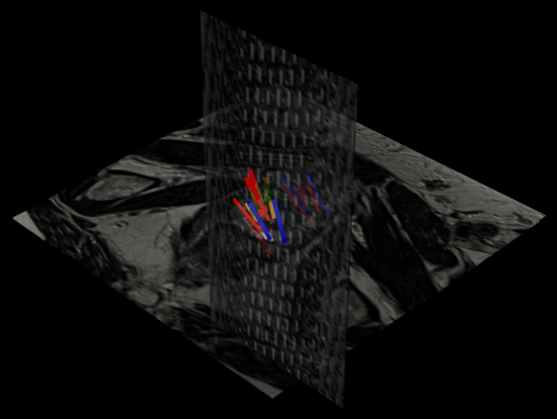
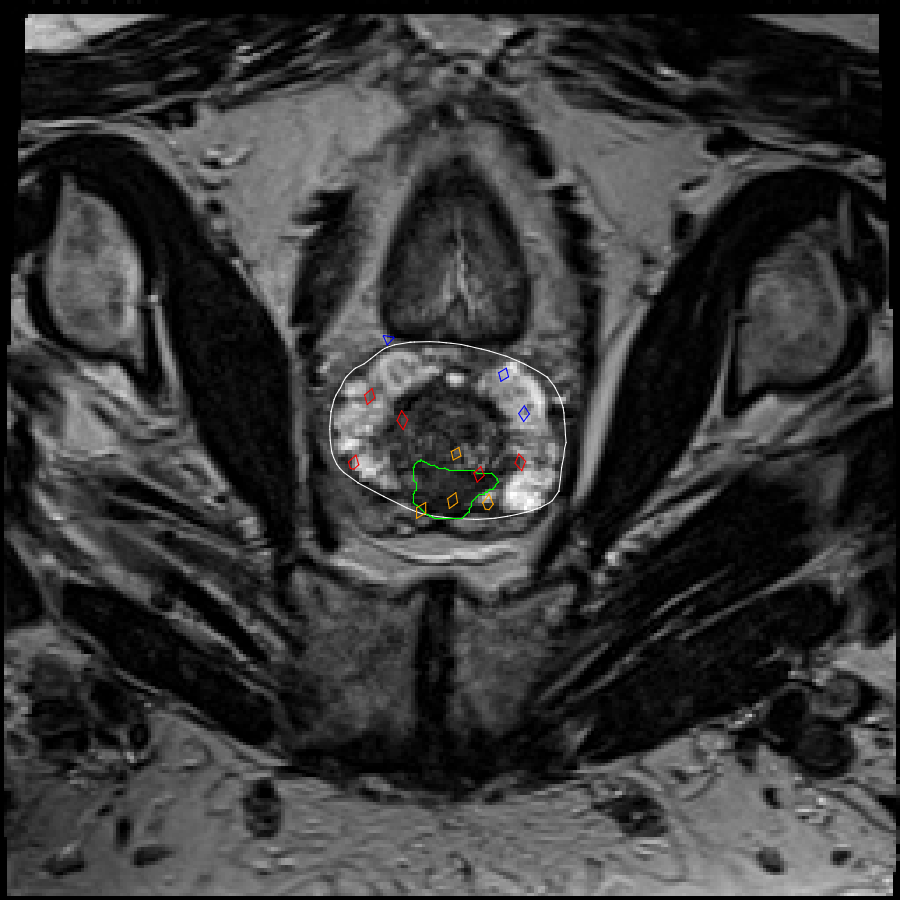
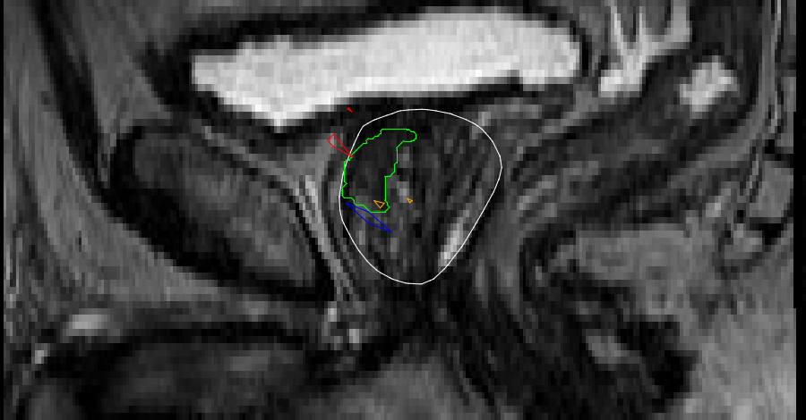
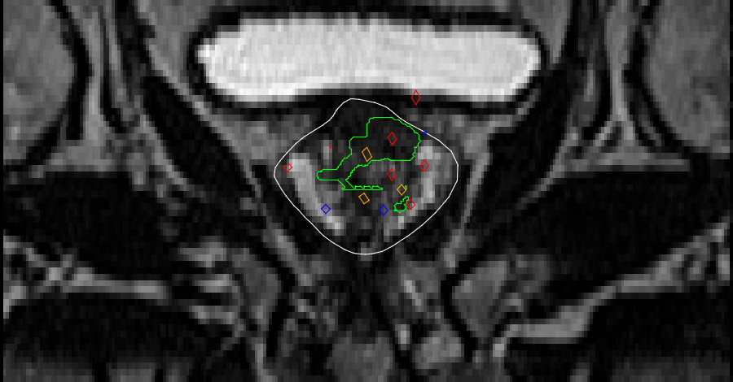
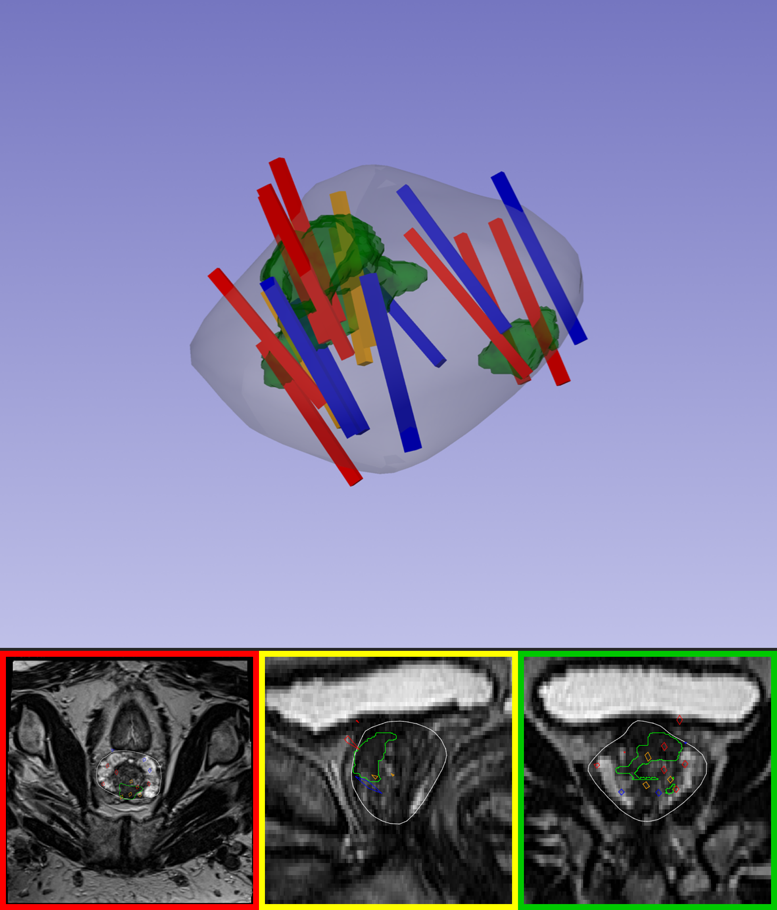

<a name="readme-top"></a>
# MRI & Ultrasound Biopsy Visualizer

The visualizer was implemented entirely in **Python rather than relying on an interactive 3D Slicer session**, providing a lightweight, reproducible, and fully scriptable workflow. This approach also reduces the additional memory and graphics overhead associated with loading multiple volumetric images, surface meshes, and biopsy trajectories simultaneously in 3D Slicer.

It is a **Python-based framework that programmatically reconstructs the TCIA prostate MRI–ultrasound fusion biopsy visualizations** without requiring 3D Slicer during execution. For each patient case, the framework renders the prostate gland, MRI-defined suspicious lesions, and all tracked biopsy needle trajectories in both **3D and standard 2D radiological views**, and then integrates these components into a single comprehensive summary visualization for convenient review and interpretation.

---

## Table of Contents

- [Background](#background)
- [Objective](#objective)
- [Dataset](#dataset)
- [Repository Structure](#repository-structure)
- [Environment Setup](#environment-setup)
- [Configuration](#configuration)
- [Running the Pipeline](#running-the-pipeline)
- [File-by-File Description](#file-by-file-description)
- [Understanding the Output Images](#understanding-the-output-images)
- [Verifying Coordinate Alignment](#verifying-coordinate-alignment)
- [Troubleshooting: Windows Long Paths](#troubleshooting-windows-long-paths)

---

## Background

In **MRI–ultrasound fusion-guided prostate biopsy**, a patient’s previously acquired multiparametric MRI, which is used to identify suspicious prostate lesions, is nonrigidly registered or “fused” with a real-time transrectal ultrasound volume acquired during the biopsy procedure. This fusion enables the urologist to accurately target MRI-visible lesions while also performing systematic sampling, typically using a 12-core biopsy template across the prostate.

Because the three-dimensional position of each biopsy needle trajectory is mechanically tracked, every tissue core can subsequently be mapped back to its precise anatomical location relative to both the MRI and ultrasound volumes. This spatial correspondence enables direct **image–pathology correlation**, providing substantially richer information than a conventional biopsy report alone.


<p align="right">(<a href="#readme-top">back to top</a>)</p>

## Objective

Build a Python framework that, for each case in the dataset, produces:

- **3D visualizations** — the prostate gland, target lesion(s), and every biopsy needle track rendered as 3D geometry, colored by Gleason score.
- **2D radiological slice views** — the standard axial/sagittal/coronal triplanar views, with the same mesh and needle-track geometry overlaid on the real MR image.
- **A single combined summary image** — the 3D scene and all three 2D views together, in one file.
- **The highest-b-value diffusion series**, exported to NIfTI for downstream analysis.

All of this from raw DICOM + STL + spreadsheet data — no manual 3D Slicer steps.

<p align="right">(<a href="#readme-top">back to top</a>)</p>

## Dataset

This framework is built around TCIA's [`Prostate-MRI-US-Biopsy`](https://www.cancerimagingarchive.net/collection/prostate-mri-us-biopsy/) collection: MR + ultrasound DICOM, STL surface meshes (prostate + target ROIs), Slicer biopsy-overlay files, and a spreadsheet of per-core tip/base coordinates and Gleason scores.

To download the dataset, go to [`MRI_Ultrasound_Visualizer/dataset`](https://github.com/rathinaraja/MRI_Ultrasound_Visualizer/tree/main/dataset). The `dataset` directory contains the files required for the MRI–ultrasound visualization workflow. Download the repository or the relevant contents of this folder before running the visualizer.


**Relevant biopsy spreadsheet columns:**

```
Bx Tip X (MRI Coord)      Bx Base X (MRI Coord)
Bx Tip Y (MRI Coord)      Bx Base Y (MRI Coord)
Bx Tip Z (MRI Coord)      Bx Base Z (MRI Coord)
```

Each row's tip/base pair defines one biopsy core's needle track, colored by its Gleason score:

| Gleason Primary + Secondary | Color |
|---|---|
| Not present (benign) | Blue |
| 3 + 3 | Orange |
| Any other combination (3+4, 4+3, 4+4, ...) | Red |

> For the full dataset description and step-by-step download instructions, see the separate **Dataset Download Guide** (`README_TCIA_download.md`).

<p align="right">(<a href="#readme-top">back to top</a>)</p>

---

## Repository Structure

```
MRI_Ultrasound_Visualizer/
├── dataset/
├── visualization/
└── outputs/
```

### `dataset/` — input data

```
dataset/
├── dicom/
│   └── Prostate-MRI-US-Biopsy-****/
│       └── prostate_mri_us_biopsy/
│           └── Prostate-MRI-US-Biopsy-****/
│               └── DICOM_UID.***/
│                   ├── MR_***/*.dcm
│                   └── US_***/*.dcm
├── manifests/
│   ├── patient_modality_summary.csv
│   ├── download_summary.json
│   ├── selected_patients.txt
│   └── selected_series.csv
└── supporting/
    ├── selected_overlays/            (zipped)
    │   └── Prostate-MRI-US-Biopsy-****/
    │       ├── *.mrml
    │       └── *.fcsv
    ├── selected_stl/                 (zipped)
    │   └── Prostate-MRI-US-Biopsy-****/
    │       └── *.STL
    └── spreadsheets/
        ├── TCIA-Biopsy-Data_2020-07-14.xlsx   — biopsy tip/base coordinates + Gleason scores
        └── Target-Data_2019-12-05.xlsx        — target ROI scoring
```

### `visualization/` — code

```
visualization/
├── config.py
├── case_utils.py
├── dicom_utils.py
├── 01_load_meshes.py
├── 02_build_biopsy_tubes.py
├── 03_visualize_scene.py
├── 04_slice_views.py
├── 05_extract_highest_bvalue_nifti.py
├── 06_combine_views.py
├── run_pipeline.py
├── verify_coordinate_system.py
├── verify_tube_mesh_alignment.py 
└── requirements.txt
```

### `outputs/` — one folder per case

```
outputs/
├── Prostate-MRI-US-Biopsy-0021/
│   ├── biopsy_tracks.csv
│   ├── biopsy_visualization.png
│   ├── biopsy_visualization.html
│   ├── biopsy_visualization_mesh_only.png
│   ├── biopsy_visualization_mesh_only.html
│   ├── axial_view.png
│   ├── sagittal_view.png
│   ├── coronal_view.png
│   ├── combined_summary.png
│   └── highest_bvalue_series.nii.gz
└── Prostate-MRI-US-Biopsy-****/
    └── ...
```

To run and validate the visualizer on a single patient case, use the unit-test code available [here](https://github.com/rathinaraja/MRI_Ultrasound_Visualizer/tree/main/unit_test).  

The unit_test directory contains the scripts required to execute the workflow for one case at a time, making it suitable for verifying the complete MRI–ultrasound visualization pipeline before scaling to multiple cases.

<p align="right">(<a href="#readme-top">back to top</a>)</p>

---

## Environment Setup
If not created already, create the virtual environment and install the required libraries.
```powershell
mkdir MRI_Ultrasound_Visualizer/visualization/
cd MRI_Ultrasound_Visualizer/visualization/

py install 3.11
py -3.11 -m venv tcia_env
.\tcia_env\Scripts\Activate.ps1

python -m pip install --upgrade pip
py -m pip install -r requirements.txt
```
if tcia_env environment already created, then install the required libraries from requirements.txt

<p align="right">(<a href="#readme-top">back to top</a>)</p>

---

## Configuration

All paths — where the DICOM/STL/spreadsheet data lives, where outputs are written — are set in **one place**: `config.py`. Edit `DATASET_ROOT` there if you move the dataset, and every other script picks up the change automatically.

`config.py` also holds `CONVERT_LPS_TO_RAS`, a single flag controlling whether biopsy coordinates, MR slice planes, and 2D contour overlays get an LPS→RAS sign flip. This has already been empirically verified for this dataset (see [Verifying Coordinate Alignment](#verifying-coordinate-alignment)) — only revisit it if you add a new dataset export with a different coordinate convention.

The primary configuration is set in config.py as follows. Refer to [Troubleshooting: Windows Long Paths](#troubleshooting-windows-long-paths) to set  Z:\ in Windows.
```powershell
DATASET_ROOT = Path("Z:/")   # <-- must match wherever you `subst`'d, e.g. Z:\ 

# ---------------------------------------------------------------------
# 2. Sub-paths derived from DATASET_ROOT (matches the folder tree spec)
# ---------------------------------------------------------------------
DICOM_BASE = DATASET_ROOT / "dataset" / "dicom"
STL_BASE   = DATASET_ROOT / "dataset" / "supporting" / "selected_stl"
OVERLAYS_BASE = DATASET_ROOT / "dataset" / "supporting" / "selected_overlays"
BIOPSY_XLSX = DATASET_ROOT / "dataset" / "supporting" / "spreadsheets" / "TCIA-Biopsy-Data_2020-07-14.xlsx"

MANIFESTS_DIR = DATASET_ROOT / "dataset" / "manifests"
SELECTED_PATIENTS_FILE = MANIFESTS_DIR / "selected_patients.txt"

OUTPUT_BASE = "outputs"
OUTPUT_BASE.mkdir(parents=True, exist_ok=True)
```

<p align="right">(<a href="#readme-top">back to top</a>)</p>

---

## Running the Pipeline

### Run everything (recommended)

```powershell
python run_pipeline.py
```

Loops every case found under `dataset/dicom/`, runs all five steps below for each one, and writes results to `outputs/<case_id>/`. A failure on one case is logged and skipped rather than stopping the batch — the run ends with a summary of exactly which cases succeeded and which didn't.

### Run one step at a time

Useful for debugging a single case or a single output file without re-running everything:

```powershell
python 03_visualize_scene.py               # 3D scenes (full + mesh-only)
python 04_slice_views.py                   # axial / sagittal / coronal 2D views
python 05_extract_highest_bvalue_nifti.py  # highest b-value -> NIfTI
python 06_combine_views.py                 # combined_summary.png
```

Each of these loops over every case on its own, same as `run_pipeline.py` does internally — so running one script alone regenerates that script's output for all cases, not just one.

<p align="right">(<a href="#readme-top">back to top</a>)</p>

---

## File-by-File Description

| File | Purpose |
|---|---|
| `config.py` | Every dataset/output path, plus the `CONVERT_LPS_TO_RAS` coordinate-flip flag, in one place. |
| `case_utils.py` | Discovers which cases exist, resolves each case's DICOM/STL/output paths, and filters that case's rows out of the shared biopsy spreadsheet. |
| `dicom_utils.py` | Shared DICOM series discovery: finds the main T2 anatomical series, the highest-b-value diffusion series, and reads series-level metadata (UID, description, b-value). |
| `01_load_meshes.py` | Loads prostate/target `.STL` meshes with pyvista, classified by filename. Filters out a duplicate MR/US-derived segmentation pair by matching each STL's embedded series UID to the case's real DICOM SeriesInstanceUID. |
| `02_build_biopsy_tubes.py` | Reads the case's biopsy rows, builds one pyvista tube mesh per core between its tip/base coordinates, colored per the Gleason rule. Drops rows with TCIA's missing-coordinate placeholder before building anything. |
| `03_visualize_scene.py` | Builds the full 3D scene (mesh + tubes + MR slice plane, black background) and the mesh-only 3D scene (gradient background, no MR/US) — both exported as PNG + interactive HTML. |
| `04_slice_views.py` | Generates the axial/sagittal/coronal 2D views: a true plane/mesh intersection through the STL and every tube, at the slice position that captures the most biopsy cores. |
| `05_extract_highest_bvalue_nifti.py` | Scans every MR series for the DICOM b-value tag (`0018,9087`, with GE/Siemens private-tag fallbacks), picks the highest, and exports that series to `.nii.gz` via SimpleITK. |
| `06_combine_views.py` | Composites the mesh-only 3D scene and all three 2D views into one bordered `combined_summary.png`. |
| `run_pipeline.py` | Single entry point — runs all five output-producing steps for every case, tolerating per-case failures. |
| `verify_coordinate_system.py` | Standalone diagnostic — checks the biopsy spreadsheet's raw coordinates against a case's `.fcsv` Slicer overlay file. |
| `verify_tube_mesh_alignment.py` | Standalone diagnostic — the test that actually settles the LPS/RAS question, by checking which coordinate hypothesis lands biopsy points inside the real STL mesh. |

<p align="right">(<a href="#readme-top">back to top</a>)</p>

---

## Understanding the Output Images

Every file below lives in `outputs/<case_id>/`. Descriptions here use example images from `outputs/sample_output/` — drop your own generated files there with matching names to see them rendered in this README.

### `biopsy_visualization.png` / `.html`

The full 3D scene: prostate capsule (semi-transparent gray), target lesion (solid green), every biopsy tube (colored by Gleason score), **plus** one or more real MR slice planes textured with actual image intensity. This is the closest equivalent to what you'd see live in 3D Slicer with the image volume loaded alongside the models — use it to confirm the tubes and mesh are spatially correct relative to the underlying MRI, not just relative to each other.

<!-- TODO: place biopsy_visualization.png in images/ --> 


The `.html` version is the same scene, but interactive and rotatable in a browser — open it directly, no Slicer or Python required.

🔗 [Open interactive 3D view](https://htmlpreview.github.io/?https://raw.githubusercontent.com/rathinaraja/MRI_Ultrasound_Visualizer/main/outputs/sample_output/biopsy_visualization.html)

### `biopsy_visualization_mesh_only.png` / `.html`

The same mesh + tubes, but with **no MR/US image data at all**, on a two-tone gradient background matching TCIA's own reference figure. Purpose: an uncluttered view that emphasizes gland shape, lesion location, and needle-track color-coding on their own — closer to a diagram than a scan, and what `combined_summary.png` uses as its 3D panel.

🔗 [Open interactive 3D view](https://htmlpreview.github.io/?https://raw.githubusercontent.com/rathinaraja/MRI_Ultrasound_Visualizer/main/outputs/sample_output/biopsy_visualization_mesh_only.html) 

### `axial_view.png`, `sagittal_view.png`, `coronal_view.png`

The three standard radiological planes, matching 3D Slicer's own color convention (**red** = axial, **yellow** = sagittal, **green** = coronal). Each is a real plane/mesh intersection through the actual MR image, the prostate/target STL outlines, and every biopsy tube — not a rendered screenshot. Together they let you orient the 3D findings within the same three views a radiologist reads a scan in.

- **Axial** (top-down) — usually the primary plane radiologists read prostate MRI in.
- **Sagittal** (side view) — needle tracks here often appear as elongated diamonds, since cores are frequently oriented closer to parallel with this plane.
- **Coronal** (front-back) — front-to-back context, useful for gland shape and lesion position relative to the midline.

<!-- TODO: place axial_view.png, sagittal_view.png, coronal_view.png in images/ -->
| Axial | Sagittal | Coronal |
|---|---|---|
|  |  |  |

### `combined_summary.png`

One image combining the mesh-only 3D scene (top) with all three 2D views (bottom row, bordered red/yellow/green). Purpose: a single at-a-glance figure combining full 3D spatial context with the standard clinical triplanar views — the file you'd actually put in a report or a slide, without needing to open four separate images.

<!-- TODO: place combined_summary.png in images/ --> 


### File type reference

| Extension | How to view it |
|---|---|
| `.png` | A static 2D image — opens in any image viewer. |
| `.html` | An interactive 3D scene — open in any web browser and rotate/zoom with the mouse. |

<p align="right">(<a href="#readme-top">back to top</a>)</p>

---

## Verifying Coordinate Alignment

Two standalone diagnostics (not part of the main pipeline) settle whether biopsy coordinates need any sign conversion before use — run once per new dataset export, not per case: for example, for a case Prostate-MRI-US-Biopsy-0396,

```powershell
python verify_coordinate_system.py --fcsv "dataset\supporting\selected_overlays\Prostate-MRI-US-Biopsy-0396.fcsv" --xlsx "dataset\supporting\spreadsheets\TCIA-Biopsy-Data_2020-07-14.xlsx" --case-id "Prostate-MRI-US-Biopsy-0396"

python verify_tube_mesh_alignment.py --stl-dir "dataset\supporting\selected_stl\Prostate-MRI-US-Biopsy-0396" --xlsx "dataset\supporting\spreadsheets\TCIA-Biopsy-Data_2020-07-14.xlsx" --case-id "Prostate-MRI-US-Biopsy-0396"
```

`verify_tube_mesh_alignment.py` is the one that actually matters: it builds biopsy points under both coordinate hypotheses and checks which one actually lands inside the real prostate STL mesh, rather than relying on a theoretical LPS/RAS assumption. The result is already reflected in `config.py`'s `CONVERT_LPS_TO_RAS` setting — you only need to re-run this if you're working with a different dataset export.

<p align="right">(<a href="#readme-top">back to top</a>)</p>

---

## Troubleshooting: Windows Long Paths

This dataset's DICOM folder nesting can exceed Windows' 260-character path limit, causing DICOM reads to fail silently. Fix it once, system-wide:

1. Open PowerShell **as Administrator**.
2. Run:
   ```powershell
   New-ItemProperty -Path "HKLM:\SYSTEM\CurrentControlSet\Control\FileSystem" -Name "LongPathsEnabled" -Value 1 -PropertyType DWORD -Force
   ```
3. Restart your computer.

If you're also working around path length with a mapped drive letter:

```powershell
# Map a short drive letter to the dataset
subst Z: "\absolute_path\...\MRI_Ultrasound_Visualizer"

# Confirm it worked
dir Z:/

# Remove the mapping
subst Z: /D

# Confirm it's gone
subst

# Re-map (e.g. after a reboot — subst mappings do not survive one)
subst Z: "\absolute_path\...\MRI_Ultrasound_Visualizer"
```

<p align="right">(<a href="#readme-top">back to top</a>)</p>
