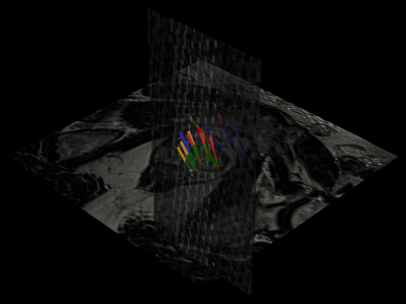
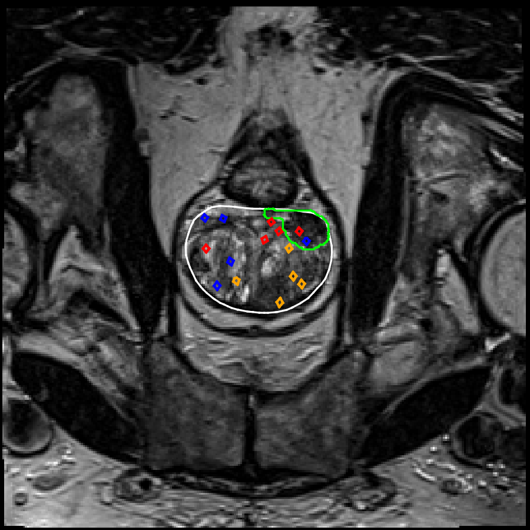
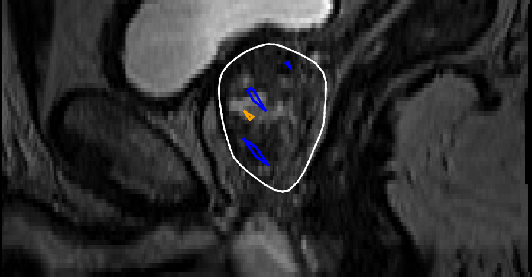
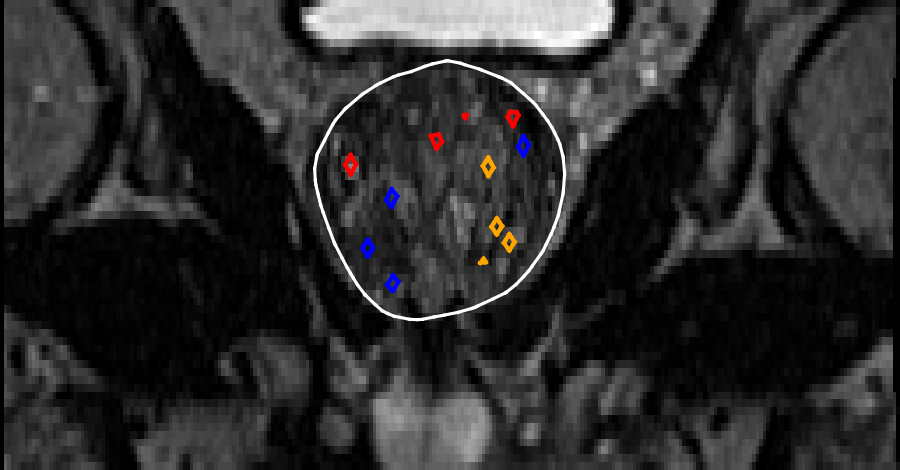
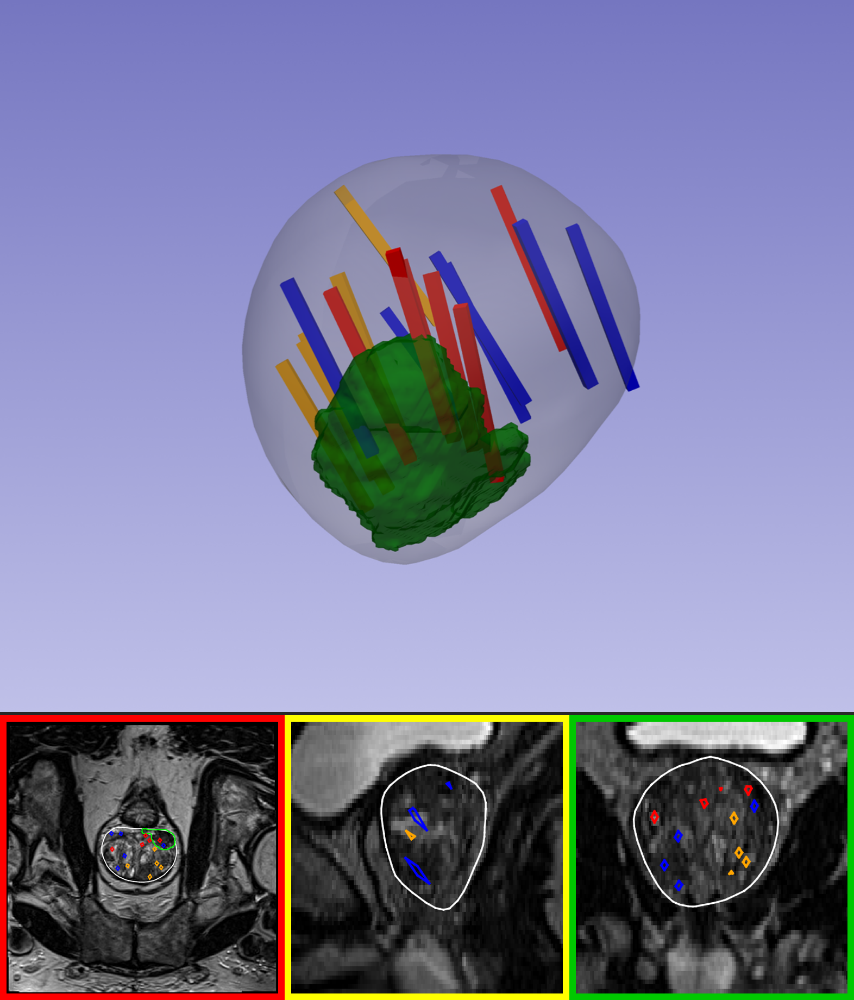

<a name="readme-top"></a>
# TCIA Case 0396 — Single-Case Unit Test

This is the **single-case validation companion** to the [MRI & Ultrasound Biopsy Visualizer](https://github.com/rathinaraja/MRI_Ultrasound_Visualizer) framework. Before running the full pipeline across all 20 dataset cases, every step, download, inventory, biopsy extraction, 3D/2D visualization, coordinate verification, is proven correct end-to-end on **one** case first: `Prostate-MRI-US-Biopsy-0396`.

Nothing here replaces the main framework's code; this bundle adds three case-preparation scripts on top of it and points the same `config.py` at a single case's data instead of a 20-case dataset root.

---

## Table of Contents

- [Background](#background)
- [Objective](#objective)
- [Why Case 0396](#why-case-0396)
- [Dataset](#dataset)
- [Repository Structure](#repository-structure)
- [Environment Setup](#environment-setup)
- [Configuration](#configuration)
- [Running the Unit Test](#running-the-unit-test)
- [File-by-File Description](#file-by-file-description)
- [Understanding the Output Images](#understanding-the-output-images)
- [Verifying Coordinate Alignment](#verifying-coordinate-alignment)
- [Troubleshooting: Windows Long Paths](#troubleshooting-windows-long-paths)

---

## Background

In MRI–ultrasound fusion-guided prostate biopsy, a patient's prior multiparametric MRI (used to identify suspicious lesions) is nonrigidly registered (fused) with a real-time transrectal ultrasound volume acquired during the biopsy. Because each needle's 3D trajectory is mechanically tracked, every core can be mapped back to its precise location relative to both the MRI and ultrasound volumes. See the main framework's README for the full background on this imaging workflow; this document focuses on validating that framework against a single, fully-characterized case.

<p align="right">(<a href="#readme-top">back to top</a>)</p>

## Objective

Prove the entire framework correct on one case before generalizing to the remaining 19:

1. Download that case's MR + US DICOM.
2. Build a DICOM metadata inventory.
3. Extract and validate its biopsy records.
4. Locate its prostate and target STL files.
5. Confirm the correct coordinate convention against real geometry.
6. Build Gleason-colored biopsy tubes.
7. Render the full 3D scene, mesh-only 3D scene, and axial/sagittal/coronal 2D views.
8. Combine everything into one summary image.
9. Identify and export the highest-b-value diffusion series to NIfTI.

Only once all of this is verified correct for `Prostate-MRI-US-Biopsy-0396` does it make sense to point the same code at the full 20-case dataset.

<p align="right">(<a href="#readme-top">back to top</a>)</p>

## Why Case 0396

This case was chosen as the pilot specifically because its ground truth is simple enough to sanity-check by hand:

- **17 biopsy cores**, all with valid MRI coordinates (no missing-data placeholders to work around on the first pass).
- **A clean, verifiable Gleason mix** — 6 benign, 5 Gleason 3+3, 6 higher-grade, so all three tube colors are exercised.
- **One MRI target** (one lesion to render, not a multi-lesion edge case).
- **A simple one-MRI/one-ultrasound series mapping** — no ambiguity about which series is which.

<p align="right">(<a href="#readme-top">back to top</a>)</p>

## Dataset

This framework is built around TCIA's [`Prostate-MRI-US-Biopsy`](https://www.cancerimagingarchive.net/collection/prostate-mri-us-biopsy/) collection: MR + ultrasound DICOM, STL surface meshes (prostate + target ROIs), Slicer biopsy-overlay files, and a spreadsheet of per-core tip/base coordinates and Gleason scores.

To download the dataset, go to [`MRI_Ultrasound_Visualizer/dataset`](https://github.com/rathinaraja/MRI_Ultrasound_Visualizer/tree/main/dataset). The `dataset` directory contains the files required for the MRI–ultrasound visualization workflow. Download the repository or the relevant contents of this folder before running the visualizer.

To download the sample case TCIA_case_0396, use the dataset directory available [here](https://github.com/rathinaraja/MRI_Ultrasound_Visualizer/tree/main/dataset).

Navigate to the dataset folder and download the complete TCIA_case_0396 directory, including all of its subfolders and files required for the MRI–ultrasound visualization workflow.

**Relevant biopsy spreadsheet columns:**

```
Bx Tip X (MRI Coord)      Bx Base X (MRI Coord)
Bx Tip Y (MRI Coord)      Bx Base Y (MRI Coord)
Bx Tip Z (MRI Coord)      Bx Base Z (MRI Coord)
```

Each row's tip/base pair defines one biopsy core's needle track, colored by its Gleason score:

| Gleason Primary + Secondary | Color |
|---|---|
| Not present (benign) | Blue |
| 3 + 3 | Orange |
| Any other combination (3+4, 4+3, 4+4, ...) | Red |

> For the full dataset description and step-by-step download instructions, see the separate **Dataset Download Guide** (`README_TCIA_download.md`).

This bundle downloads **only** `Prostate-MRI-US-Biopsy-0396` from TCIA's [`Prostate-MRI-US-Biopsy`](https://www.cancerimagingarchive.net/collection/prostate-mri-us-biopsy/) collection; its MR + ultrasound DICOM, via `01_download_case_0396.py`.

Two things are **not** automated by the scripts in this bundle and need to be obtained separately:

- **The biopsy spreadsheet** (`TCIA-Biopsy-Data_2020-07-14.xlsx`) — download it from the collection page; `03_extract_biopsy_case_0396.py` reads it directly and filters out this one case's 17 rows.
- **The STL and biopsy-overlay files** for this case — download the STL and Biopsy-Overlays-3DSlicer packages from the collection page (Aspera browser helpers required), then place this case's files under `supporting/selected_stl/Prostate-MRI-US-Biopsy-0396/` and `supporting/selected_overlays/Prostate-MRI-US-Biopsy-0396/` respectively. If you've already downloaded the full 20-case package for the main framework, you can just copy this one case's files out of it instead of re-downloading.

<p align="right">(<a href="#readme-top">back to top</a>)</p>

---

## Repository Structure

```
unit_test/ 
├── dataset_TCIA_case_0396/
├── download_TCIA_case_0396/
├── output_TCIA_case_0396/ 
└── visualization_code/
```

### `unit_test/dataset_TCIA_case_0396/` — one case's data (= `CASE_ROOT` in `config.py`)

```
dataset_TCIA_case_0396/
├── biopsy/
│   └── case_0396_biopsy_tracks.csv
├── dicom/
│   └── prostate_mri_us_biopsy/
│       └── Prostate-MRI-US-Biopsy-0396/
│           ├── 1.3.6.1.4.1.14519.5.2.1.243215884171213879668099366010618486775/
│           │   ├── MR_1.3.6.1.4.1.14519.5.2.1.118432358883624532096253314924516639723/*.dcm
│           │   ├── MR_1.3.6.1.4.1.14519.5.2.1.25720106245064176288901986915012203145/*.dcm
│           │   └── MR_1.3.6.1.4.1.14519.5.2.1.76190057244344771860739653654820227132/*.dcm
│           └── 1.3.6.1.4.1.14519.5.2.1.257592290519819476859276356250602320923/
│               └── US_1.3.6.1.4.1.14519.5.2.1.130614821430940002608488302197529593031/*.dcm
├── inventory/
│   ├── case_0396_dicom_instances.csv
│   └── case_0396_series_summary.csv
├── manifests/
│   └── case_0396_series.csv
├── supporting/
│   ├── selected_overlays/
│   │   └── Prostate-MRI-US-Biopsy-0396/
│   │       ├── *.mrml
│   │       └── *.fcsv
│   └── selected_stl/
│       └── Prostate-MRI-US-Biopsy-0396/
│           └── *.STL
└── output_TCIA_case_0396         
```

### `visualization_code/` — code

```
unit_test/visualization_code/
├── config.py
├── requirements.txt
├── README.txt 
├── 01_load_meshes.py                  
├── 02_build_biopsy_tubes.py
├── 03_visualize_scene.py
├── 04_slice_views.py
├── 05_extract_highest_bvalue_nifti.py
├── 06_combine_views.py
└── run_all.py
```

<p align="right">(<a href="#readme-top">back to top</a>)</p>

---

## Environment Setup

```powershell
mkdir MRI_Ultrasound_Visualizer/unit_test/visualization_code/
cd MRI_Ultrasound_Visualizer/unit_test/visualization_code/

py install 3.11
py -3.11 -m venv tcia_env
.\tcia_env\Scripts\Activate.ps1

python -m pip install --upgrade pip
py -m pip install -r requirements.txt
```

If `tcia_env` already exists from the main framework, just activate it and install any missing packages from this bundle's `requirements.txt`.

<p align="right">(<a href="#readme-top">back to top</a>)</p>

---

## Configuration

The primary configuration is set in config.py as follows. Refer to [Troubleshooting: Windows Long Paths](#troubleshooting-windows-long-paths) to set  Z:\ in Windows.
```powershell
CASE_ROOT = Path("Z:/")   # <-- must match wherever you `subst`'d, e.g. Z:\

# ---------------------------------------------------------------------
# 2. Sub-paths derived from CASE_ROOT (matches the folder tree you have)
# ---------------------------------------------------------------------
DICOM_ROOT = CASE_ROOT / "dicom" / "prostate_mri_us_biopsy" / "Prostate-MRI-US-Biopsy-0396"
STL_DIR    = CASE_ROOT / "supporting" / "selected_stl" / "Prostate-MRI-US-Biopsy-0396"
BIOPSY_CSV = CASE_ROOT / "biopsy" / "case_0396_biopsy_tracks.csv"
OUTPUT_DIR = "output_TCIA_case_0396"

```

`config.py` also holds `CONVERT_LPS_TO_RAS` (currently `False` for this case — see [Verifying Coordinate Alignment](#verifying-coordinate-alignment)) and the case's known `MAIN_MRI_SERIES_UID` / `US_SERIES_UID`, used to pick the right STL file when the folder contains both an MR-derived and a US-derived copy of the same surface.

> `config.py`'s `CASE_ROOT` should point at `data/TCIA_case_0396` (via a mapped drive letter on Windows — see [Troubleshooting](#troubleshooting-windows-long-paths)). Adjust the two folder names above to match your own layout if you organize it differently; nothing here depends on these exact names except `CASE_ROOT` itself.
 
<p align="right">(<a href="#readme-top">back to top</a>)</p>

---

## Running the Unit Test

Run these in order — each step depends on the previous one's output.

### Step 1 — Query the case (no download yet)

```powershell
python 01_download_case_0396.py --output "TCIA_case_0396" --query-only
```

Confirms the case has both MR and US series available, and writes the series manifest, before downloading any image data.

### Step 2 — Download the DICOM

```powershell
python 01_download_case_0396.py --output "TCIA_case_0396"
```

### Step 3 — Build the DICOM inventory

```powershell
python 02_inventory_dicom_case_0396.py --dicom-root "TCIA_case_0396\dicom" --output "TCIA_case_0396\inventory"
```

Reads every DICOM header (no pixel data) and writes a per-file and a per-series CSV summary — useful for confirming series counts, modalities, and b-values before moving on.

### Step 4 — Extract and validate the biopsy records

```powershell
python 03_extract_biopsy_case_0396.py --excel "C:\path\to\TCIA-Biopsy-Data_2020-07-14.xlsx" --output "TCIA_case_0396\biopsy"
```

Filters the shared spreadsheet down to this case's 17 rows, validates each core's MRI coordinates (missing/non-numeric, the `-1000` placeholder, zero-length tracks), and assigns each core its tube class and color.

### Step 5 — Run the visualization pipeline

Once `config.py`'s `CASE_ROOT` points at this case's prepared data:

```powershell
python 03_visualize_scene.py               # 3D scenes (full + mesh-only)
python 04_slice_views.py                   # axial / sagittal / coronal 2D views
python 05_extract_highest_bvalue_nifti.py  # highest b-value -> NIfTI
python 06_combine_views.py                 # combined_summary.png
```

Or run all four in one go:

```powershell
python run_all.py
```

<p align="right">(<a href="#readme-top">back to top</a>)</p>

---

## File-by-File Description 

### Visualization pipeline (single-case variant of the main framework)

| File | Purpose |
|---|---|
| `config.py` | Every path for this one case, plus `CONVERT_LPS_TO_RAS` and the case's known series UIDs. |
| `01_load_meshes.py` | Loads prostate/target `.STL` meshes, filtered by series UID to drop the duplicate MR/US-derived segmentation pair. |
| `02_build_biopsy_tubes.py` | Reads `case_0396_biopsy_tracks.csv`, builds one tube mesh per core, colored per the Gleason rule; drops any remaining missing-coordinate rows. |
| `03_visualize_scene.py` | Builds the full 3D scene (mesh + tubes + MR slice plane) and the mesh-only 3D scene, each as PNG + interactive HTML. |
| `04_slice_views.py` | Generates the axial/sagittal/coronal 2D views at the slice position that captures the most biopsy cores. |
| `05_extract_highest_bvalue_nifti.py` | Finds this case's highest-b-value DICOM series and exports it to `.nii.gz`. |
| `06_combine_views.py` | Composites the mesh-only 3D scene and all three 2D views into one bordered `combined_summary.png`. |
| `run_all.py` | Convenience entry point — runs Step 5's four scripts in order. |

<p align="right">(<a href="#readme-top">back to top</a>)</p>

---

## Understanding the Output Images

Every file below lives in `outputs/<case_id>/`. Descriptions here use example images from `outputs/sample_output/` — drop your own generated files there with matching names to see them rendered in this README.

### `biopsy_visualization.png` / `.html`

The full 3D scene: prostate capsule (semi-transparent gray), target lesion (solid green), every biopsy tube (colored by Gleason score), **plus** one or more real MR slice planes textured with actual image intensity. This is the closest equivalent to what you'd see live in 3D Slicer with the image volume loaded alongside the models — use it to confirm the tubes and mesh are spatially correct relative to the underlying MRI, not just relative to each other.

<!-- TODO: place biopsy_visualization.png in images/ --> 


The `.html` version is the same scene, but interactive and rotatable in a browser — open it directly, no Slicer or Python required.

🔗 [Open interactive 3D view](https://htmlpreview.github.io/?https://raw.githubusercontent.com/rathinaraja/MRI_Ultrasound_Visualizer/main/unit_test/output_TCIA_case_0396/biopsy_visualization.html)

### `biopsy_visualization_mesh_only.png` / `.html`

The same mesh + tubes, but with **no MR/US image data at all**, on a two-tone gradient background matching TCIA's own reference figure. Purpose: an uncluttered view that emphasizes gland shape, lesion location, and needle-track color-coding on their own — closer to a diagram than a scan, and what `combined_summary.png` uses as its 3D panel.

🔗 [Open interactive 3D view](https://htmlpreview.github.io/?https://raw.githubusercontent.com/rathinaraja/MRI_Ultrasound_Visualizer/main/unit_test/output_TCIA_case_0396/biopsy_visualization_mesh_only.html) 

### `axial_view.png`, `sagittal_view.png`, `coronal_view.png`

The three standard radiological planes, matching 3D Slicer's own color convention (**red** = axial, **yellow** = sagittal, **green** = coronal). Each is a real plane/mesh intersection through the actual MR image, the prostate/target STL outlines, and every biopsy tube — not a rendered screenshot. Together they let you orient the 3D findings within the same three views a radiologist reads a scan in.

- **Axial** (top-down) — usually the primary plane radiologists read prostate MRI in.
- **Sagittal** (side view) — needle tracks here often appear as elongated diamonds, since cores are frequently oriented closer to parallel with this plane.
- **Coronal** (front-back) — front-to-back context, useful for gland shape and lesion position relative to the midline.

<!-- TODO: place axial_view.png, sagittal_view.png, coronal_view.png in images/ -->
| Axial | Sagittal | Coronal |
|---|---|---|
|  |  |  |

### `combined_summary.png`

One image combining the mesh-only 3D scene (top) with all three 2D views (bottom row, bordered red/yellow/green). Purpose: a single at-a-glance figure combining full 3D spatial context with the standard clinical triplanar views — the file you'd actually put in a report or a slide, without needing to open four separate images.

<!-- TODO: place combined_summary.png in images/ --> 


### `case_0396_biopsy_tracks.csv`, inventory CSVs, manifest CSV

The intermediate artifacts from Steps 1–4 above — not visualizations, but the audit trail confirming exactly which series and which biopsy rows fed into the images: which series were queried and downloaded, every DICOM header read, and every core's validated coordinates and assigned tube class.

### `highest_bvalue_series.nii.gz`

The case's highest-b-value diffusion series, exported for downstream analysis outside this pipeline.

### File type reference

| Extension | How to view it |
|---|---|
| `.png` | A static 2D image — opens in any image viewer. |
| `.html` | An interactive 3D scene — open in any web browser and rotate/zoom with the mouse. |
| `.csv` | Tabular data — opens in Excel or any text editor. |
| `.nii.gz` | A compressed NIfTI volume — opens in tools like ITK-SNAP, 3D Slicer, or `nibabel` in Python. |

<p align="right">(<a href="#readme-top">back to top</a>)</p>

---

## Verifying Coordinate Alignment

The main framework's standalone diagnostics apply here unchanged (copy them into `scripts/` if they're not already present):

```powershell
python verify_coordinate_system.py --fcsv "dataset_TCIA_case_0396\supporting\selected_overlays\Prostate-MRI-US-Biopsy-0396\...(US-date-20110218)__Data__Bx-2-Benign.fcsv" --xlsx "dataset_TCIA_case_0396\supporting\spreadsheets\TCIA-Biopsy-Data_2020-07-14.xlsx" --case-id "Prostate-MRI-US-Biopsy-0396"

python verify_tube_mesh_alignment.py --stl-dir "dataset_TCIA_case_0396\supporting\selected_stl\Prostate-MRI-US-Biopsy-0396" --xlsx "dataset_TCIA_case_0396\supporting\spreadsheets\TCIA-Biopsy-Data_2020-07-14.xlsx" --case-id "Prostate-MRI-US-Biopsy-0396"
```

`verify_tube_mesh_alignment.py` is the one that actually matters: it builds biopsy points under both the raw and X/Y-flipped coordinate hypotheses and checks which one actually lands inside this case's real prostate STL mesh. This is exactly how `config.py`'s `CONVERT_LPS_TO_RAS = False` was determined for case 0396 — the result already reflected in `config.py` here, so you only need to re-run this if you're validating a different case with its own STL export.

<p align="right">(<a href="#readme-top">back to top</a>)</p>

---

## Troubleshooting: Windows Long Paths

This dataset's DICOM folder nesting can exceed Windows' 260-character path limit, causing DICOM reads to fail silently. Fix it once, system-wide:

1. Open PowerShell **as Administrator**.
2. Run:
   ```powershell
   New-ItemProperty -Path "HKLM:\SYSTEM\CurrentControlSet\Control\FileSystem" -Name "LongPathsEnabled" -Value 1 -PropertyType DWORD -Force
   ```
3. Restart your computer.

Map a short drive letter to this case's data folder so `config.py`'s `CASE_ROOT` stays short regardless of how deep the real path is:

```powershell
# Map a short drive letter to the case data folder
subst Z: "\absolute_path\...\unit_test"

# Confirm it worked
dir Z:/

# Remove the mapping
subst Z: /D

# Confirm it's gone
subst

# Re-map (e.g. after a reboot — subst mappings do not survive one)
subst Z: "\absolute_path\...\unit_test"
```

<p align="right">(<a href="#readme-top">back to top</a>)</p>
